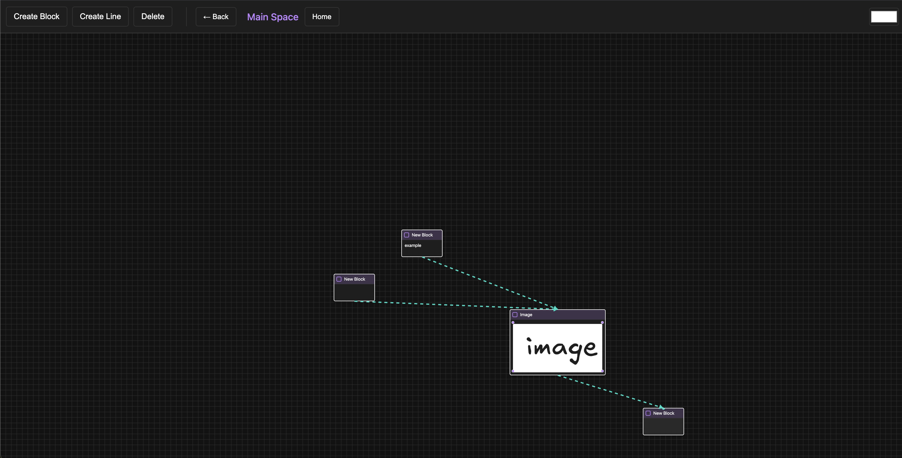
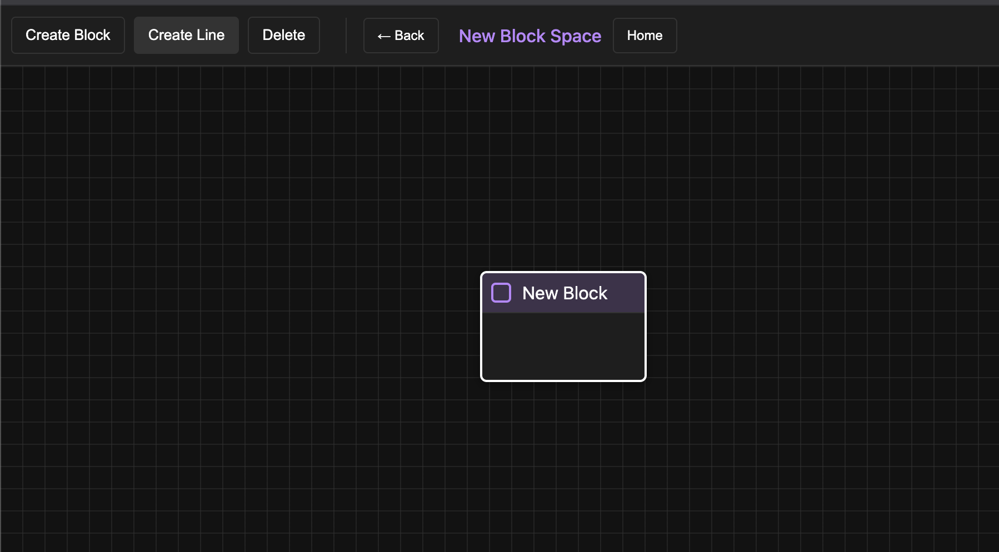

# 🎨 **Whitespace - Flow Chart Todo**

> A visual, **infinite canvas** for organizing your thoughts, tasks, and projects like never before.

---

## ✨ Features

### 🧩 **Visual Task Management**
- Create blocks to represent tasks and connect them with lines  
- Drag, drop, and arrange your blocks freely on a **spatial canvas**

### 🌀 **Nested Workspaces**
- Double-click a block to **enter its own workspace**
- Organize complex systems with **infinite nesting**

### ✅ **Task Completion**
- Mark tasks as completed with checkboxes

### 🎨 **Customizable Appearance**
- Change **colors** of blocks and lines to categorize visually  
- Resize images and elements to suit your layout

### 🧭 **Smooth Navigation**
- Navigate easily with **Back** and **Home** buttons  
- **Pan** and **zoom** across your canvas like a digital whiteboard

### 💾 **Persistent Local Storage**
- All changes are **automatically saved** to your browser  
- No servers, no logins — **your data stays with you**

### 🧠 **Editable Everything**
- Blocks have editable **titles** and **content** areas  
- Create **visual connections** between blocks to show relationships

---

## 💡 Use Cases

| 📚 **Application**       | ✨ **What You Can Do** |
|--------------------------|------------------------|
| 📂 **Project Management** | Break down tasks into subtasks and phases |
| 🧠 **Mind Mapping**        | Build interconnected ideas and networks |
| 📓 **Study Notes**         | Create chapters with nested notes and examples |
| 🌱 **Life Planning**       | Plan goals, sub-goals, and action items |
| 📖 **Reading Notes**       | Organize by book → chapter → insights |
| 🧾 **Meeting Notes**       | Document discussions with deep-dive notes |
| 🧬 **Decision Trees**      | Map out possible outcomes and consequences |
| 🛠 **Process Documentation** | Record workflows, SOPs, and guides |
| 📚 **Knowledge Base**      | Build your personal wiki of ideas |

---

## 🚀 Getting Started

1. 🖱 Open `index.html` in your browser
2. ➕ Click "Create Block" to add tasks
3. 🔗 Use "Create Line" to connect them
4. 🖱 Double-click a block to **open its nested space**
5. 🏠 Use "Back" and "Home" to move around your task universe

---

## 🧱 Using Nested Workspaces

Nested spaces = next-level organization.

- 💡 **Double-click a block** to enter its nested whitespace  
- ➕ Create new blocks and lines **inside the nested space**  
- 🔙 Hit "Back" to return to the parent  
- 🏠 Click "Home" to return to the root canvas  
- ♾ **Unlimited nesting** for ultimate hierarchy and detail  
- 🎯 Keep each layer contextually clean and organized

---

## 🎮 Controls

| 🛠 **Action**           | ⌨️ **How To** |
|------------------------|----------------|
| ➕ Create Block         | Click "Create Block" |
| 🔗 Create Line          | Click "Create Line" then select two blocks |
| ❌ Delete               | Select item and press delete |
| 🎨 Change Color         | Use the color picker for blocks/lines |
| 🖱 Pan Canvas           | Drag empty space with your mouse |
| 🔙 Back / 🏠 Home        | Use navigation buttons |
| ✏️ Edit Titles/Content  | Click text to edit |
| 🖱 Double-Click Block   | Enter nested workspace |

---

## 🧠 How Data is Stored

🗂 All your data is **stored locally** in your browser’s `localStorage`.  
🔒 No internet, no servers — it’s 100% private.

---

## 🛠 Built With

- 🌐 **HTML**
- 🎨 **CSS**
- 🧠 **Vanilla JavaScript**

---

## 🖼 Screenshots

### 🧩 Main Space  

### 🔍 Zoomed Out  

### 🧱 Nested Workspace  

### ✅ Checked Out  

---

